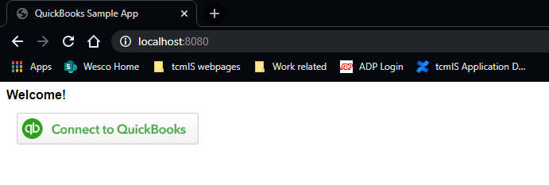

# invoice-quickbook-prototype
Prototype currently uses company's data and invoice template created in Hoa's QuickBooks Sandbox.

- To use another's data: in [application.properties](https://github.com/Wescoair/invoice-quickbook-prototype/blob/master/src/main/resources/application.properties), change values of following fields to that of the new account:
   - quickbooks.oauth2.client-id
   - quickbooks.oauth2.secret
- To Run prototype:
   1. Start application as a Java Application.
   2. Go to http://localhost:8080/. 
   3. Click on the image. A new popup window should appear.
   4. In the new popup, if using Hoa's data, select 'Haas...' for the company to be used. Popup should close and the opener page should be refreshed. 
   5. In the opener page, enter a value in invoice.invoice_number and click the button. If successful, a file called targetFile.pdf will be created at location specified in [application.properties](https://github.com/Wescoair/invoice-quickbook-prototype/blob/master/src/main/resources/application.properties) - 'invoice.save-directory' field. 

Note:
- The QuickBooks login page will require the developer account's password, so it's best to create an account in advance.
